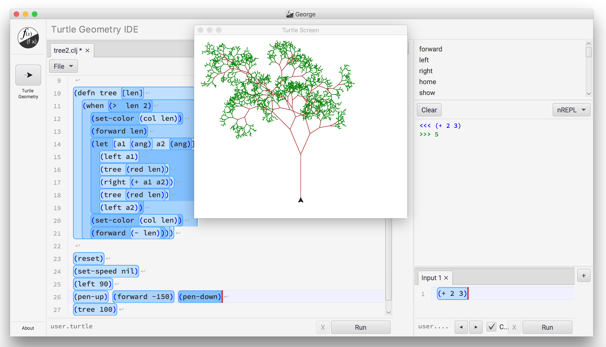

  
*Create. Learn. Think.*

***

This is the application code for [George](http://www.george.andante.no).

It can be run as a standalone Jar, or as a natively installed application for Windows or Mac, and some time in the future, Linux.

If you simply want to run George, it will be much quicker and easier for you to download and install the latest native version for your system.  That way you are also guaranteed to always have an automatically updated latest version.  

[Get George for Windows / Mac / Linux / Java](https://htmlpreview.github.io/?https://github.com/terjedahl/george/blob/master/docs/get_george.html).

## Develop and contribute

We would love your help developing George.

To learn more about how to download and run the source, develop, contribute, start with [docs/index.md](https://bitbucket.org/andante-george/george-application/src/default/docs/index.md).

***

## License

Copyright © 2016-2019 Terje Dahl

Distributed under the [Eclipse Public License 1.0](https://opensource.org/licenses/eclipse-1.0.php).

***
